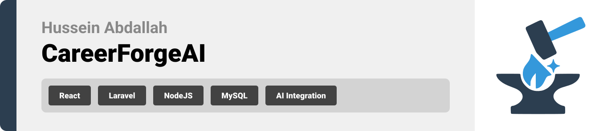

  

<!-- project overview -->

> CareerForgeAI is a platform designed to help job seekers get better chances at landing a job and firing up their career. The platform features an AI interview Simulator that conducts real-time voice mock interviews, providing users with some practice and feedback
>
> Additionally, it helps job seekers improve their resumes by tailoring them to a specific job description while ensuring compatibility with Applicant Tracking Systems (ATS). Furthermore CareerForgeAI includes a Salary Estimator that analyzes market trends and suggests relevant pay ranges, helping users confidently negotiate compensation.

  

<!-- System Design -->

<!-- ### ER Diagram -->

| ER Diagram                                      |
| ----------------------------------------------- |
| 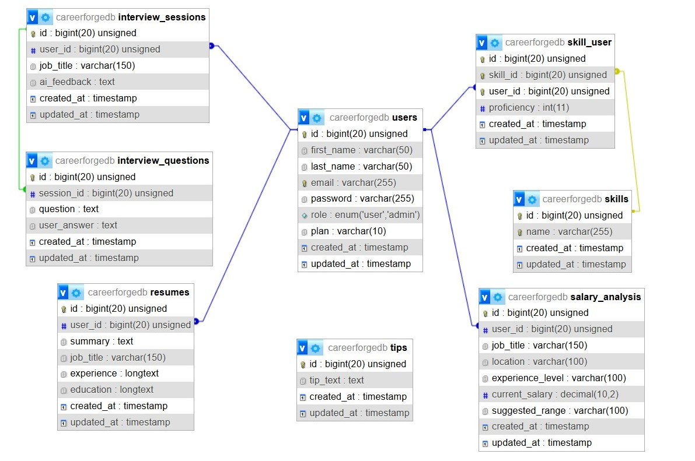        |
| Container Diagram                               |
|  |

  

<!-- Project Highlights -->

### The most remarkable features

<!--
- Interview Simulator, AI conducts a realtime voice interview and gives you feedback on your answers.
- AI Resume Tailoring Input your information, and AI writes it for your desired job and following ATS.
- Salary Estimator Analyzes market data to suggest optimal pay ranges. -->

| Features                          |
| --------------------------------- |
|  |

  

<!-- Demo -->

<!-- ### User Screens (Mobile)

| Login screen                            | Register screen                       | Register screen                       |
| --------------------------------------- | ------------------------------------- | ------------------------------------- |
|  |  |  | -->

### Admin Screens (Web)

| Dashboard                                        | Salary Estimation                          |
| ------------------------------------------------ | ------------------------------------------ |
|             |            |
| Interview Question                               | Interview Result                           |
|   | 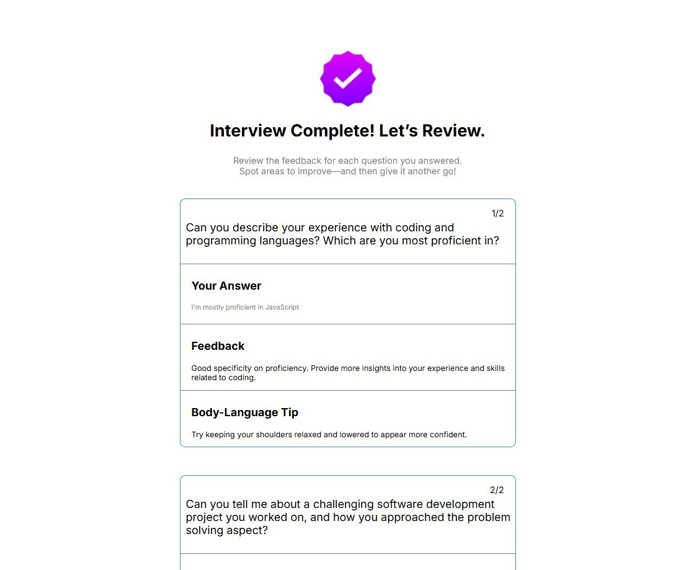 |
| Resume Builder                                   | Improve Resume with AI                     |
| 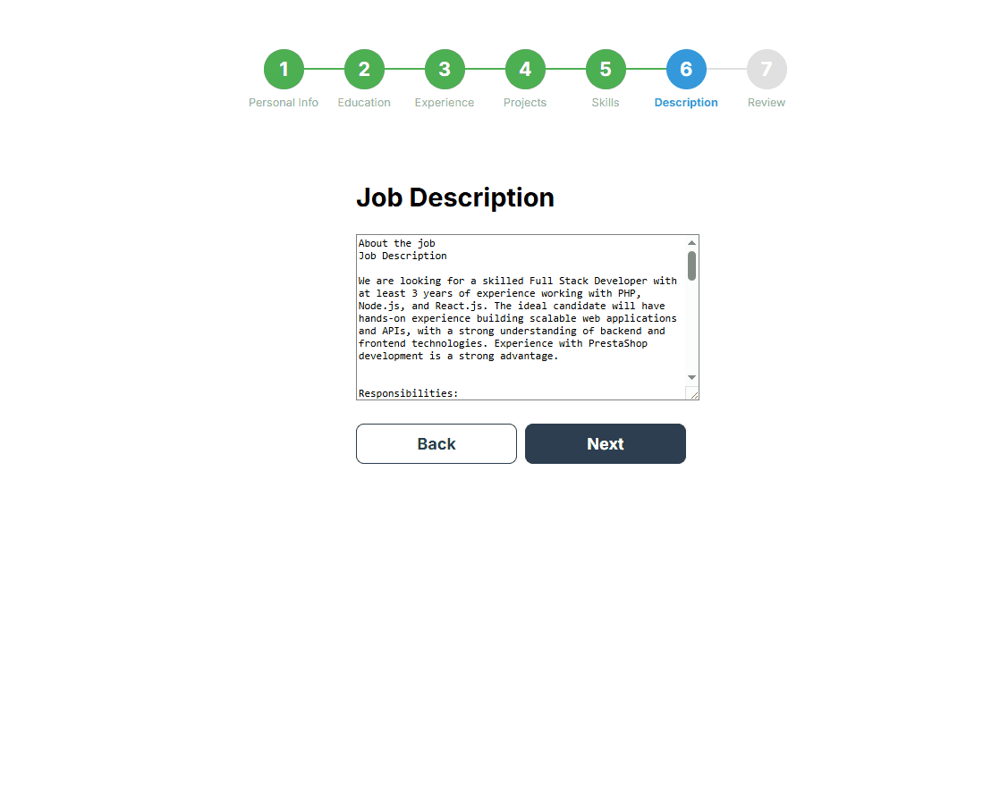 | 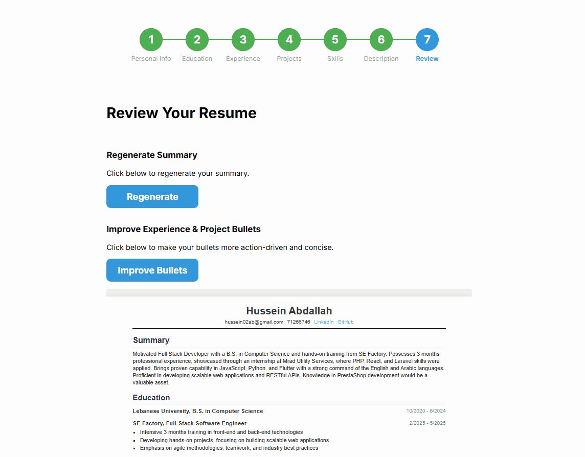  |

  

<!-- Development & Testing -->

### Add Title Here

| Controller                                      | Model                                    | Testing                                         |
| ----------------------------------------------- | ---------------------------------------- | ----------------------------------------------- |
|  | 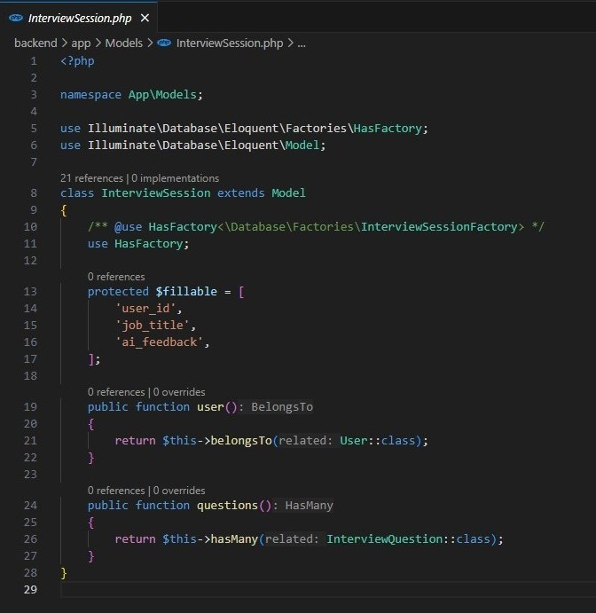 | 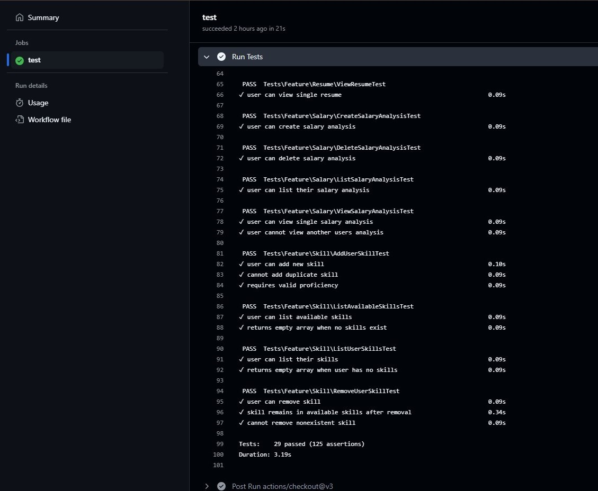        |
| Service                                         | Trait                                    | Testing                                         |
|     |  |  |

  

<!-- AI-Powered APP -->

<!-- ### Add Title Here

- Description here. -->

| Route                             | Service                           | Salary Prompt                    |
| --------------------------------- | --------------------------------- | -------------------------------- |
| 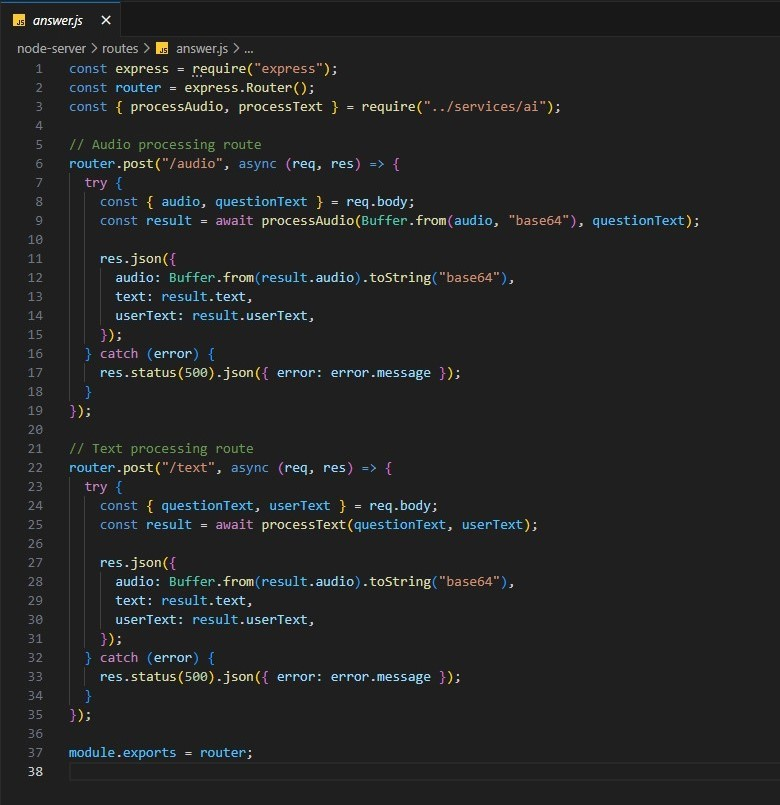 | 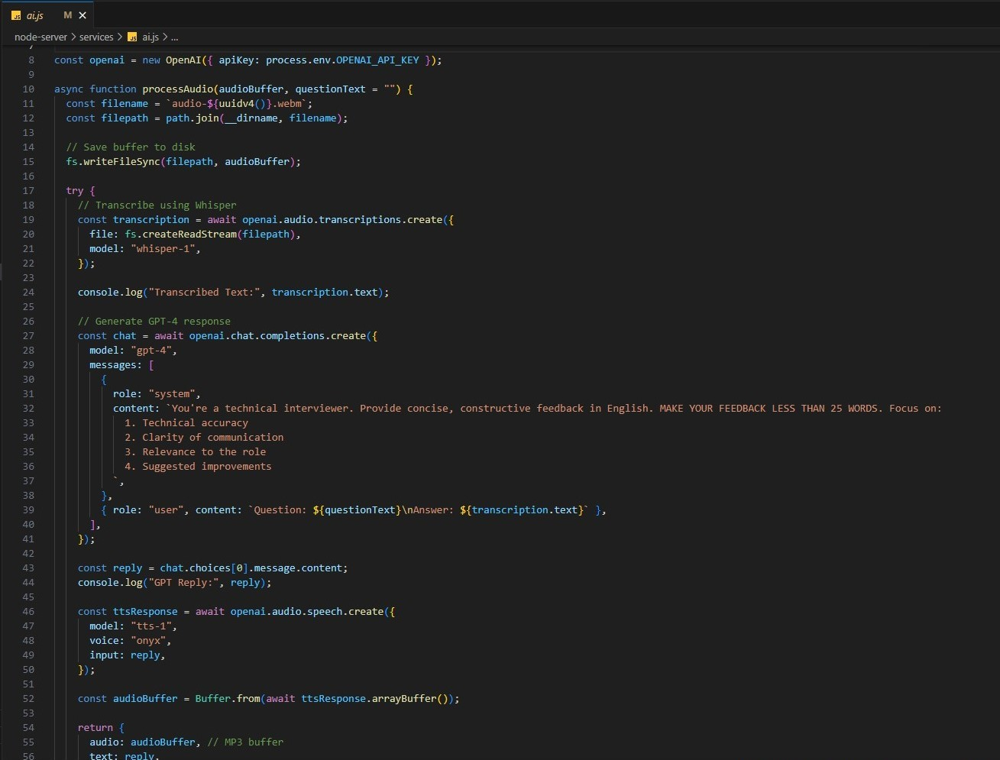 |  |

  

<!-- Deployment -->

<!-- ### Add Title Here

- Description here. -->

| Postman API 1                             | Postman API 2                           | Postman API 3                           |
| ----------------------------------------- | --------------------------------------- | --------------------------------------- |
| 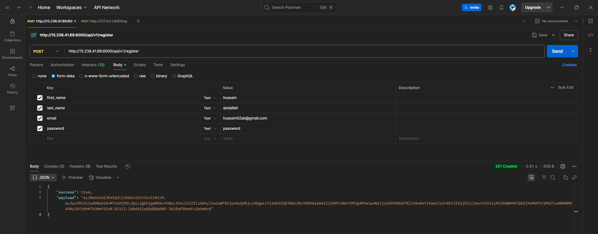 |  | 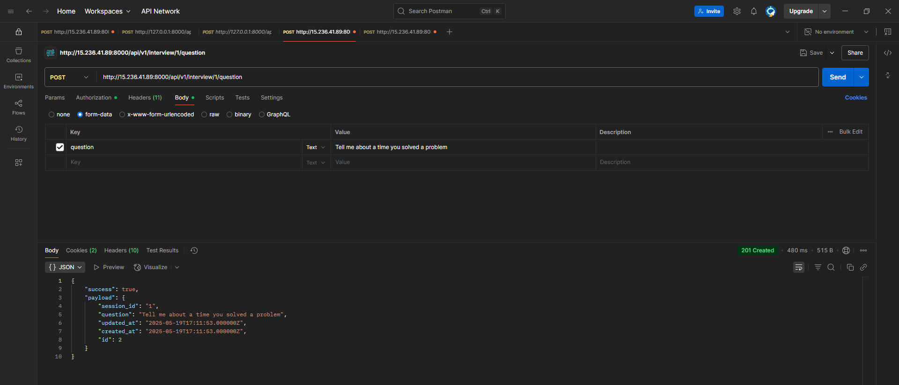 |

  
